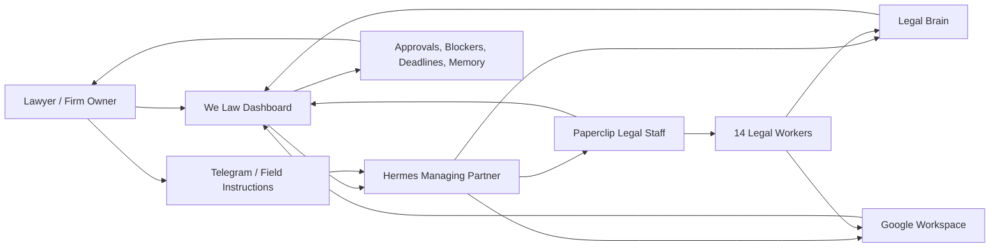

# We Law OS

**We Law OS is an open-source attempt to build a lawyer-controlled, agentic legal firm operating system.** It combines a human-first legal dashboard, Hermes as the proactive legal operating layer, Paperclip as a structured multi-worker legal staff system, and Google Workspace as the familiar office surface where legal work actually lives.

It is not a single legal agent, not a document bot, and not a Kanban board. It is a proposal for a legal firm operated with agents while the lawyer remains the owner of the firm, the responsible professional, and the final approval gate for legal judgment and client-facing work.

## Origins

We Law OS comes from:

- the vision and experimentation of **We Law**;
- legal-operations research and prototypes from **WSC.Lat**;
- real tests trying to make agent systems useful for a lawyer's daily work;
- painful lessons coordinating reasoning, documents, memory, transcript intake, Drive, Docs, Sheets, tasks, deadlines, review, deliverables and human approval.

## The Five Layers

### 1. Human Control Layer: The Dashboard

The frontend is central. The dashboard is where the lawyer and Hermes coexist. Hermes can act proactively, but the lawyer needs a trusted surface to inspect, approve, correct and understand the legal office.

The dashboard should let a non-technical lawyer see active clients, matters, Hermes requests, Paperclip workers, documents, missing information, blockers, deadlines, approvals, memory and Workspace links without opening a terminal.

### 2. Hermes Layer: Managing Partner, Project Manager, Assistant

Hermes is the operating intelligence. It receives instructions from Telegram or dashboard, understands client and matter context, remembers prior work, consults the Legal Brain, transforms instructions into structured work, coordinates Paperclip, watches missing information, prepares partner briefs, manages follow-ups, helps with agenda/tasks/deadlines, and prepares letters or communications.

Hermes does not replace the lawyer. It helps the lawyer run the firm with continuity, memory, delegation and proactive follow-through.

### 3. Google Workspace Layer: Familiar Legal Office

Google Workspace matters because lawyers already understand Drive, Docs, Sheets, Calendar, Tasks and email-style communications. We Law OS should not force a lawyer to abandon familiar office tools. It should make those tools legible to Hermes, Paperclip workers and the dashboard.

Drive stores client and matter folders. Docs are the natural drafting surface. Sheets become the Control Master for clients, matters, documents, missing facts, deadlines and status. Calendar and Tasks become the human agenda and follow-up layer.

### 4. Paperclip Layer: Legal Staff With 14 Workers

Paperclip is the structured legal staff layer. It is not just a Kanban board. Each worker should have a role contract, required artifacts, comment/writeback contract, blockers, closure semantics, skills, tools/validators, approval gates and explicit limits.

1. **Managing Desk / Despacho Legal** — Coordinates the matter, owns routing and status, integrates specialist output, reports to the firm owner, and blocks unsafe closure.
2. **Legal Reception / Intake** — Receives transcripts, notes and initial documents; extracts client and matter data; classifies missing information.
3. **Records Manager / Expediente** — Builds the live file, indexes sources, maintains folder structure, version history and evidence provenance.
4. **Google Sheets Data Clerk** — Updates the Control Master, converts intake into structured rows and maintains operational ledgers.
5. **Legal Research Analyst** — Identifies legal basis, risk, required documents, assumptions and research blockers before drafting.
6. **Legal Documents Associate** — Drafts contracts, pleadings and document packages using templates, data ledgers, evidence maps and placeholders.
7. **Privacy & Compliance Associate** — Handles privacy notices, ARCO, data-processing matrices, confidentiality and compliance issues.
8. **IP & Software Associate** — Handles IP ownership, software development, developer contracts, licenses, assignments and technology NDAs.
9. **Litigation Associate** — Prepares claims, pleadings, procedural strategy, court-file support and evidence tables.
10. **Deadlines Clerk** — Computes deadlines, maintains reminders, flags uncertainty and prevents silent deadline loss.
11. **Collections & Billing Clerk** — Tracks retainers, payments, collections, billing blockers and client follow-up letters.
12. **Editorial Production** — Produces presentable versions, checks formatting, package order, PDF/DOCX/Docs readiness and client-facing polish.
13. **Senior Legal Reviewer** — Runs legal gates, cross-document review and delivery/signature readiness decisions.
14. **Knowledge & Template Manager** — Maintains lessons, templates, clause libraries, playbooks and institutional memory updates.

### 5. Legal Brain Layer

The Legal Brain prevents every conversation from becoming another fresh chat. It stores clients, matters, facts, documents, sources, processes, risks, jurisdictions, templates, preferences, lessons, missing information and decision history. Hermes uses it to orchestrate. Paperclip workers use it for context. The dashboard uses it to give the human lawyer certainty.

## Architecture



## What We Are Trying To Solve

- How should an AI legal firm remember clients and matters safely?
- How should workers extract facts from transcripts without losing evidence?
- How should drafting workers avoid shrinking legal documents into summaries?
- How should a multi-agent legal package be reviewed across documents?
- How should Drive, Docs and Sheets stay human-friendly and agent-readable?
- How should a dashboard show agent work in a way a non-technical lawyer trusts?
- How should Paperclip workers behave like staff with roles, tools, blockers and accountability?
- How should Hermes stay proactive without bypassing lawyer control?
- How should legal templates, editorial quality and signing readiness be gated?
- How should privacy and client confidentiality be preserved in open-source legal-agent systems?

## Quick Install

```bash
git clone https://github.com/cuentadeservicio377-cell/we-law-open-source.git
cd we-law-open-source
bash scripts/setup.sh
bash scripts/demo.sh
```

Then open http://127.0.0.1:3012.

The default install is an offline-first demo. It includes synthetic fixtures, dashboard, skills, schemas, docs and safety checks. Live Hermes, Paperclip and Google Workspace integration is documented but opt-in because public repos must not ship private credentials or client data.

## Full Install And Integration Docs

- [Install on a fresh computer](docs/03-install-run/reinstall-any-computer.md)
- [Live Hermes, Paperclip and Workspace integration](docs/03-install-run/live-integrations.md)
- [System architecture](docs/02-architecture/we-law-os.md)
- [Operational flow](docs/06-operations/end-to-end-flow.md)
- [Problems where we need help](docs/07-community/problems-we-need-help-solving.md)

## Repository Map

- `dashboard/` — lawyer-facing control center.
- `skills/` — Hermes skill contracts and Python tools.
- `config/` — firm model, worker contracts, command spine and legal trigger config.
- `schemas/` — JSON contracts for clients, matters, documents, memory, workspace and Paperclip payloads.
- `fixtures/demo/` and `data/` — synthetic demo client/matter/workflow.
- `workspace/brain/` — public Legal Brain structure.
- `runtime/scripts/` — dry-run/live-adapter scripts, sanitized for public use.
- `scripts/` — setup, demo, doctor, test and safety scan.

## Safety

This public repository must never contain real client data, live Drive links, tokens, personal paths, production logs or private Workspace exports. Run this before committing:

```bash
python3 scripts/public_safety_scan.py
```

## Disclaimer

This project is research and tooling. It is not legal advice, does not create an attorney-client relationship and does not replace professional legal judgment. A licensed lawyer must review and approve all client-facing work.
