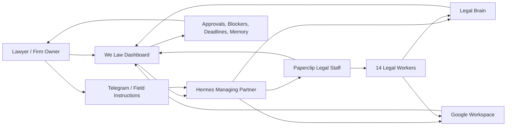

# What Is We Law OS?

We Law OS is an open-source attempt to build a lawyer-controlled, agentic legal firm operating system. It combines a human-first legal dashboard, Hermes as the proactive legal operating layer, Paperclip as a structured multi-worker legal staff system, Google Workspace as the familiar office surface where legal work actually lives, and a Legal Brain that keeps context from disappearing.

## Public Thesis

We Law OS aims to make an AI legal firm operationally real: not just drafting isolated documents, but managing intake, clients, matters, memory, files, legal workers, approvals, deadlines, communications, Workspace artifacts and lawyer oversight in one auditable system.

It does not claim autonomous agents can replace legal judgment. It explores how legal work can be decomposed into accountable agent roles while preserving human legal control, traceability and professional review.

## Layers

### Dashboard

The dashboard is the human control layer. It should feel like entering a legal office: clients, active matters, pending approvals, missing facts, workers, documents, deadlines and memory should be visible and understandable.

### Hermes

Hermes is the Managing Partner, second brain, legal operations orchestrator, project manager and executive legal assistant. Hermes receives instructions, resolves context, consults memory, delegates work, monitors blockers and prepares briefs.

### Google Workspace

Workspace is the office layer: Drive for folders, Docs for drafts, Sheets for Control Master ledgers, Calendar for agenda, Tasks for follow-up and communications for client operations.

### Paperclip

Paperclip is the staff/project ledger. The 14 legal workers act as structured posts in a legal firm, not generic prompt agents.

### Legal Brain

The Legal Brain keeps client, matter, process, risk, document, template and institutional memory available to Hermes, workers and the dashboard.

## Diagram

